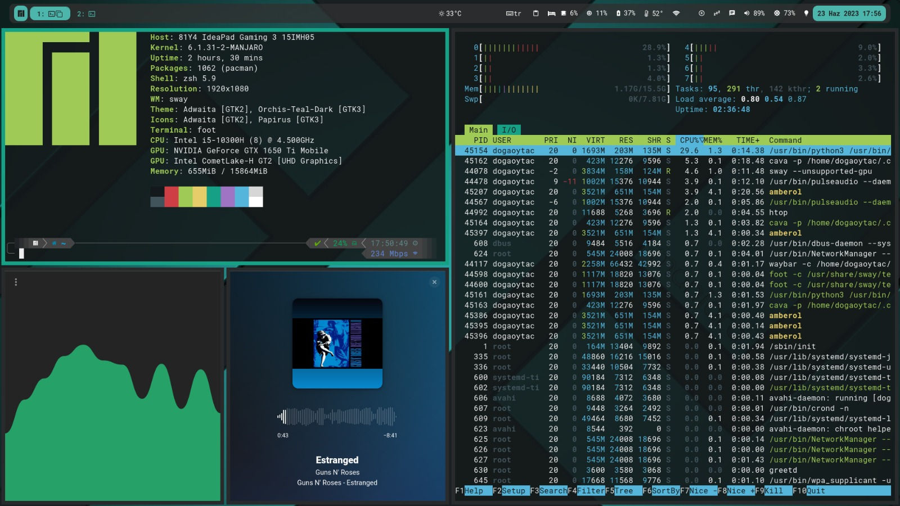
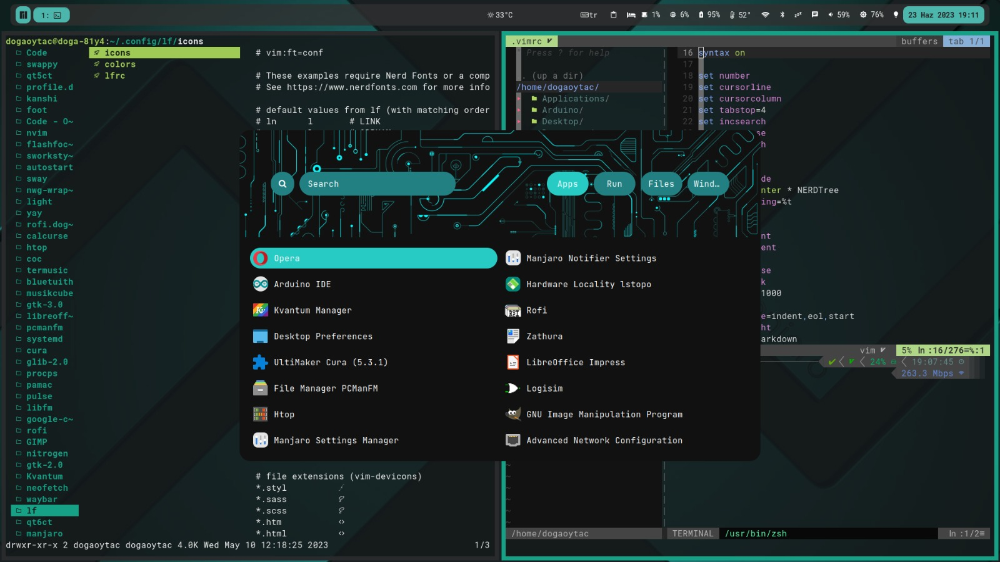

# manjaro-sway-dotfiles

- **Editor:** [Vim](https://github.com/vim/vim)
- **GTK Theme:** [Orchis-Teal-Dark](https://github.com/vinceliuice/Orchis-theme)
- **Cursor:** [Catppuccin-Macchiato-Dark](https://github.com/catppuccin/cursors)
- **Music Visualizer:** [CAVA](https://www.linuxfordevices.com/tutorials/linux/cavalier)
- **Music Player:** [Amberol](https://apps.gnome.org/app/io.bassi.Amberol/)

## Border and stuff
> **Directory:**: ~/.config/sway/config.d 
## lf
> **Directory:** /home/username/.config/lf
##  Rofi
 - **Theme:** [adi1090x](https://github.com/adi1090x/rofi)
   Type-7's style-2
> **Directory:**  /home/username/.config/rofi/launchers/type-7/style-2.rasi

> **~/.config/rofi/scripts/launcher_t7** added to **menu.conf**
## Sway
>**Directory:** ~/.config/sway/definitions.d/ 
## Waybar
>**Directory:** /home/username/.config/waybar
## zshrc
- Theme: [powerlevel10k](https://github.com/romkatv/powerlevel10k)
>**Directory:**  /home/username/.config/zsh/.zshrc
